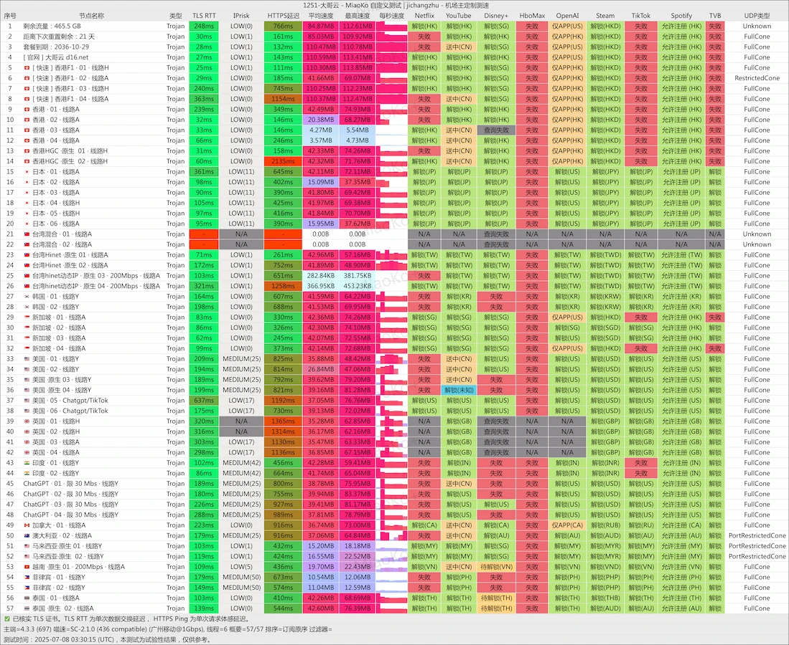

# 扬帆云
扬帆云，Vmess 中转小众加速服务全解析。

## 扬帆云机场简介

**扬帆云机场**（英文 *yangfan cloud*，亦常称 **扬帆云** 或 **扬帆云加速**）是一家 2025 年上线的 `Vmess` 协议中转小众加速服务。作为新晋“云加速”品牌，**扬帆云机场** 主打跨境公网隧道技术，为用户提供 **扬帆云加速** 节点，覆盖香港、日本、台湾、新加坡、美国、韩国等热门地区，另有法国与马来西亚等相对冷门地区。

## 试用环境与工具

- **客户端**：Clash.Meta、Shadowrocket、sing-box  
- **设备**：Windows 11 PC、iOS 17 手机、macOS 15 笔电  
- **网络**：本地千兆光纤 + Wi‑Fi 6  
- **套餐**：LV2 月付（200 GB / 500 Mbps）

为确保数据客观，我在不同时间段对 **扬帆云加速** 节点进行了 <abbr title="Ping、下载、上传、延迟抖动">多维测速</abbr>，并对 **Netflix**、**Disney+**、**ChatGPT** 等服务做了解锁验证。

## 节点解锁与速度表现

**扬帆云机场** 的香港 NF 节点在晚高峰依旧可稳定 350‑420 Mbps，Netflix 与 Disney+ 解锁毫无压力；美西节点速率中规中矩（260‑300 Mbps），但 *ChatGPT* 对话流畅。本次试用所有 **扬帆云加速** 节点均成功通过流媒体检测，且未出现 IP 被封或验证码问题。

## 套餐与价格

| 套餐 | 月费      | 月流量 | 限速       | 设备数 |
|------|-----------|--------|-----------|--------|
| LV1  | ￥15.99   | 100 GB | 200 Mbps  | 2      |
| LV2  | ￥29.99   | 200 GB | 500 Mbps  | 3      |
| LV3  | ￥39.99   | 400 GB | 1000 Mbps | 4      |
| LV4  | ￥49.99   | 700 GB | 2000 Mbps | 6      |
| 旗舰 | ￥88.99   | 1200 GB| 2000 Mbps | 6      |

年付可叠加 **7 折优惠码 `618`**。若你是重度视频 / AI 用户，建议从 LV2 起步体验 **扬帆云加速**。官方暂未提供不限时流量包，流量于购买日按月重置，未使用完不会累积。

## 优缺点总结

### 优点
1. 全节点均解锁主流流媒体与 AI 工具。  
2. 支持多平台订阅：Clash、Surge、Shadowrocket、Stash、sing-box 等。  
3. 支付宝直付，符合国区支付习惯。  
4. 官网后端及面板加载迅速，新人上手门槛低。  

### 不足
1. 官网附带的旧版 Clash 客户端存在误报风险，建议自行前往 GitHub 下载。  
2. 节点数目较少，网络高峰时段偶尔会有轻微抖动。  
3. 暂不支持按量付费或转赠流量。  

## 试用结论

经过一周深度体验后，我认为 **扬帆云机场** 是当前小众 `Vmess` 中转服务里表现较为均衡的选择。若你想要在 **扬帆云** 生态内获得稳定的 **扬帆云加速** 体验，又不想折腾复杂配置，LV2 或 LV3 套餐已足以满足日常 4K 流媒体与 AI 需求。高阶用户可关注官方节点后续扩容，以进一步提升 **扬帆云机场** 的可玩性。

> **扬帆云** - Vmess 中转小众加速服务全解析：访问 [官网](https://tiao.bid/333) 订阅。
